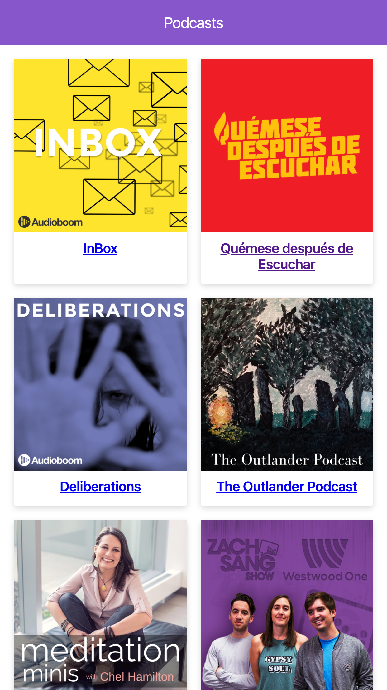

# App de podcast

Esta es una aplicacion creada con el framework nextJs para poder escuchar tus podcasts

[ver la aplicación](https://y-rho.now.sh/)

## Cómo funciona?

Requiere nodeJs

- `npm install` para instalar las dependencias.
- `npm run dev` para el entorno de desarrollo.
- `npm run build && npm start` para el entorno de producción.

## Licencia

MIT
